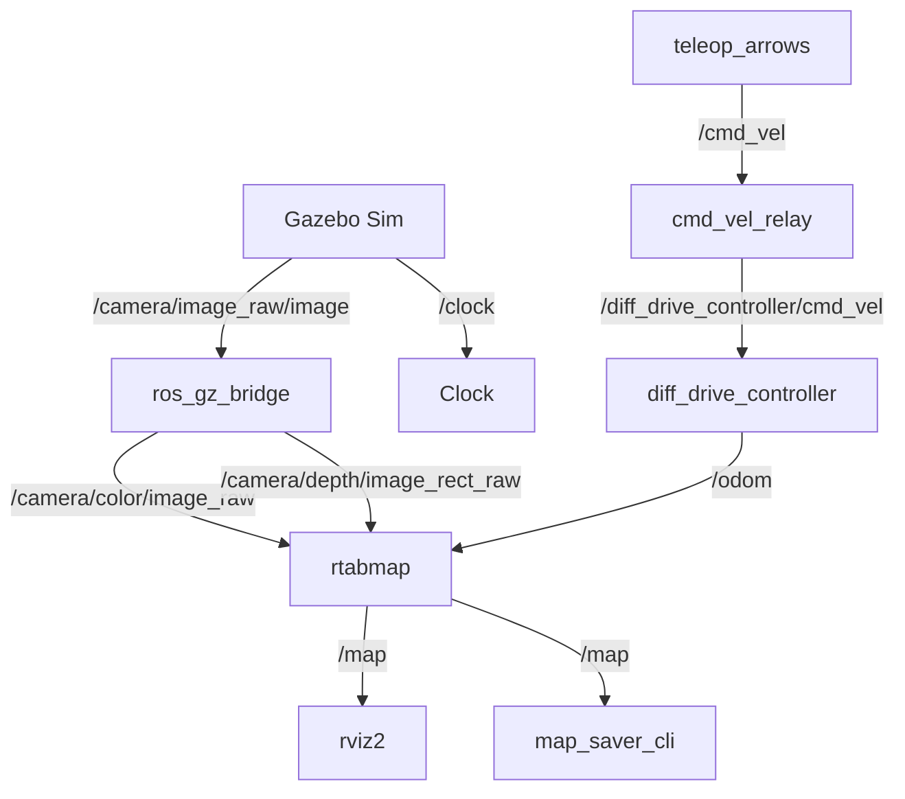

# Phase 3 Progress Report — RTAB-Map SLAM Mapping & Map Export
### Swachh Boudhik Yantra | ROS 2 Jazzy | Gazebo Harmonic | RTAB-Map

---

## 1. Executive Summary
This report documents the design, architecture, challenges, and implementation results of **Phase 3: SLAM Mapping and Map Export** (as per the gazebo_slam_nav_roadmap) for the autonomous indoor vacuum cleaning robot. All key systems have been successfully verified, mapping executed in the Gazebo simulation, and the occupancy grid map exported successfully.

---

## 2. Architecture & Design Decisions
To transition from a basic simulation to a functional mapping stack, the following architectural layers were added and verified:
1. **RTAB-Map (Real-Time Appearance-Based Mapping):** Configured as the core SLAM package. Fuses Intel RealSense D435i color/depth images and odometry.
2. **CycloneDDS Integration:** Configured as the ROS 2 middleware to bypass symbol conflicts inside `librealsense2` dependencies.
3. **Type-Safe Command Relay (`cmd_vel_relay`):** Solved the ROS 2 Jazzy `diff_drive_controller` requirement of `TwistStamped` messages by translating the teleop node's `Twist` messages with active simulation clock stamps.
4. **Custom Arrow Teleoperation (`teleop_arrows`):** Implemented a clean keyboard-focused node supporting arrows keys and live publication logs.

---

## 3. Package Layout
The workspace structure remains modular and organized:
```
vacuum_ws/
├── install/
└── src/
    ├── vacuum_bringup/
    │   └── launch/
    │       └── sim.launch.py            # Master simulation launch
    ├── vacuum_controller/
    │   ├── config/
    │   │   └── controllers.yaml         # Controller configs (update_rate: 50Hz)
    │   ├── launch/
    │   │   └── controllers.launch.py    # Controller lifecycle spawner
    │   └── vacuum_controller/
    │       ├── cmd_vel_relay.py         # Twist -> TwistStamped converter node
    │       └── teleop_arrows.py         # Arrow key steering node
    ├── vacuum_description/
    │   └── urdf/
    │       ├── _ros2_control.xacro      # Hardware interface config
    │       └── _gazebo.xacro            # Gazebo plugins (gz_ros2_control)
    ├── vacuum_gazebo/
    │   ├── config/
    │   │   └── gz_bridge.yaml           # Clock & realsense camera bridge topics
    │   └── worlds/
    │       └── apartment.sdf            # Furnished apartment world
    └── vacuum_slam/                     # SLAM Mapping Package
        ├── config/
        │   ├── rtabmap.yaml             # RTAB-Map core parameter file
        │   └── slam_rviz.rviz           # Pre-configured RViz visualizer
        ├── launch/
        │   ├── slam.launch.py           # SLAM node launch
        │   └── map_saver.launch.py      # nav2_map_server CLI map saver
        └── package.xml                  # SLAM manifest dependencies
```

---

## 4. Dependencies
* `rtabmap_slam`
* `nav2_map_server`
* `rmw_cyclonedds_cpp`
* `topic_tools`

---

## 5. Node Graph


---

## 6. Topic List
* `/cmd_vel` (`geometry_msgs/msg/Twist`)
* `/diff_drive_controller/cmd_vel` (`geometry_msgs/msg/TwistStamped`)
* `/odom` (`nav_msgs/msg/Odometry`)
* `/camera/color/image_raw` (`sensor_msgs/msg/Image`)
* `/camera/depth/image_rect_raw` (`sensor_msgs/msg/Image`)
* `/camera/color/camera_info` (`sensor_msgs/msg/CameraInfo`)
* `/map` (`nav_msgs/msg/OccupancyGrid`)

---

## 7. Configuration Files
* **[controllers.yaml](file:///home/bmscecse/Swachh_Boudhik_Yantra/Simulation/vacuum_ws/src/vacuum_controller/config/controllers.yaml)** (control loop frequency, kinematic limits)
* **[rtabmap.yaml](file:///home/bmscecse/Swachh_Boudhik_Yantra/Simulation/vacuum_ws/src/vacuum_slam/config/rtabmap.yaml)** (loop closure thresholds, point cloud voxel grid size)

---

## 8. Build Instructions
To compile the workspace:
```bash
cd /home/bmscecse/Swachh_Boudhik_Yantra/Simulation/vacuum_ws
source /opt/ros/jazzy/setup.bash
source /home/bmscecse/ros2_ws/install/setup.bash
colcon build --symlink-install
```

---

## 9. Runtime Instructions
We created a fully automated launch process:
1. **Start Simulator, SLAM, Visualizers, and Teleop:**
   ```bash
   cd /home/bmscecse/Swachh_Boudhik_Yantra
   ./run_mapping.sh
   ```
2. **Drive the robot:** Focus the terminal and use **Arrow Keys** (Spacebar to stop).
3. **Save Map when finished:**
   ```bash
   cd /home/bmscecse/Swachh_Boudhik_Yantra
   ./save_map.sh
   ```
4. **View saved map:**
   ```bash
   cd /home/bmscecse/Swachh_Boudhik_Yantra
   ./view_map.sh
   ```

---

## 10. Validation Steps & Exported Maps
The mapping session successfully exported the 2D occupancy grid:
* **Map Configuration:** [map.yaml](file:///home/bmscecse/maps/stage4/map.yaml)
* **Map Image:** [map.pgm](file:///home/bmscecse/maps/stage4/map.pgm)

---

## 11. Failure Modes & Debugging Guide
1. **Python 3.14 Environment Collisions:** Ubuntu 26.04 uses Python 3.14 as system default, but ROS 2 Jazzy relies on Python 3.12. Running `ros2 run` directly parses shebangs pointing to Python 3.14. **Mitigation:** Prepend commands with `python3.12` explicitly.
2. **FastDDS crashes with realsense:** Symbol collisions occur between OSRF FastCDR and RealSense libraries. **Mitigation:** Switch middleware to CycloneDDS by exporting `RMW_IMPLEMENTATION=rmw_cyclonedds_cpp`.
